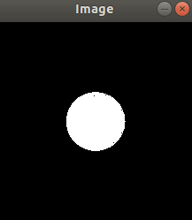

# Turtlesim_Webcam
Webcam image publisher and image processing node to command turtlesim. You are provided image publisher for a webcam, the goal for this part is to identify the object color in the image and publish corresponding command to turtlesim node.

Here is the video of what this is all about is given in the video folder:  
video/2020-04-10-ColorControllerDemo.mp4  
or see this link:  
https://drive.google.com/file/d/1DOAUNTje5rRYcS00hzvwLPZ7xUVF88D_/view?usp=sharing

## Initialization
### Packages install
ROS is using python2, so every python package we are installing is python2 version.
```
$ pip install opencv-python
$ sudo apt-get install ros-melodic-cv-bridge
```
### Create workspace
`$ mkdir ~/ros_ws/src`
### Clone Repo
```
$ cd ~/ros_ws/src
$ git clone https://github.com/hehonglu123/Robot_Programming.git
$ catkin_make
```
Once this is done, you have your own catkin workspace with ROS package 'robot_programming'. Since we are using rospy, it's not necessary to rebuild the workspace everytime you make modification to your script.


## Commands for starting this node
Make sure you have connected a webcam first.
1) Source the directory:
```
$ cd ros_ws
$ source devel/setup.bash
```
2) Run roscore:  
`$ roscore`  
3) Launch the webcam publisher with command:
`$ rosrun  robot_programming webcam_pub.py` 
4) Subscribe to image messages show it on a separate window:  
`$ rosrun robot_programming webcam_sub.py`  
You will be able to see a window pop out with webcam image.

## Color Object Identification
There're total of 3 actions: go straight, turn left and turn right. Here you are provided a simple example script identifying the red object.
There's an image of a red circle in this directory. Simply run the detection_red.py by `$ python detection_red.py`, it will output a picture after filter, and print the output. Note that this code does NOT include any ROS, it's pure python and openCV. We will come to ROS part in the next. Try it out! 

OpenCV image is a 3D array of 'BGR' format, with dimention (image_height,image_width,channels). The OpenCV native function [`inRange(input_image,lower_bound,upper_bound)`](https://docs.opencv.org/3.4/da/d97/tutorial_threshold_inRange.html) takes input image and filter out all pixels without the range. The output image is black/white image, with white part as the pixels falling inside the range.



The function `connectedComponentsWithStats(input_image)` runs the [Connected Component Labeling](https://en.wikipedia.org/wiki/Connected-component_labeling) on the input image, and returns stats associated with it. Using those stats, we can easily filter out noise (small count) and only identify objects at the center part of the image (centroid of the object near image center).
Try tuning the lower_bound and upper_bound parameters to identify blue and green objects!

## Task
1) Use the given detection_red.py script to tune upper and lower bound for green and blue objects. Feel free to find green/blue images online.

2) Use the given webcam_sub.py to implement image processing with red, green and blue objects. Try print out which color object is detected  

3) Initialize a publisher to command the turtlebot. 

4) Integrate everything to command the turtlebot with color-code.
