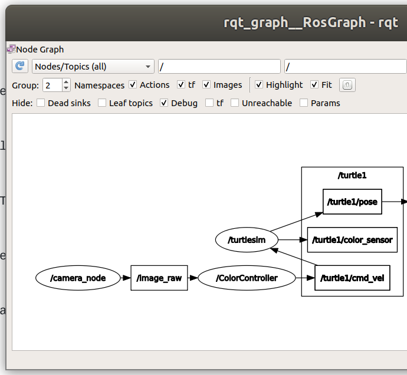

# Turtlesim_Webcam
Webcam image publisher and image processing node to command turtlesim. You are provided image publisher for a webcam, the goal for this part is to identify the object color in the image and publish corresponding command to turtlesim node.

Here is the video of what this is all about is given in the video folder:  
video/2020-04-10-ColorControllerDemo.mp4  
or see this link:  
https://drive.google.com/file/d/1DOAUNTje5rRYcS00hzvwLPZ7xUVF88D_/view?usp=sharing

## Color Object Identification
There're total of 3 actions: go straight, turn left and turn right. Here you are provided a simple example script identifying the red object.
There's an image of a red circle in this directory. Simply run the detection_red.py by `$ python detection_red.py`, it will output a picture after filter, and print the output. Note that this code does NOT include any ROS, it's pure python and openCV. We will come to ROS part in the next. Try it out! 

OpenCV image is a 3D array of 'BGR' format, with dimention (image_height,image_width,channels). The OpenCV native function [`inRange(input_image,lower_bound,upper_bound)`](https://docs.opencv.org/3.4/da/d97/tutorial_threshold_inRange.html) takes input image and filter out all pixels without the range. The output image is black/white image, with white part as the pixels falling inside the range.

The function `connectedComponentsWithStats(input_image)` runs the [Connected Component Labeling](https://en.wikipedia.org/wiki/Connected-component_labeling) on the input image, and returns stats associated with it. Using those stats, we can easily filter out noise (small count) and only identify objects at the center part of the image (centroid of the object near image center).
Try tuning the lower_bound and upper_bound parameters to identify blue and green objects!

## Commands for starting this node
1) Run roscore:  
`$ roscore`  
2) Run Turtlesim Node, this will show you turtle sim in empty world:  
`$ rosrun turtlesim turtlesim_node`  

3) Check Which topics that turtlesim subscribed graphically with command:  
`$ rqt_graph`  

4) Make sure you select not to hide Dead Sinks and Leaf Topics, Tf.  
You can also use to see what topics you have currently:  
`$ rostopic list`  
5) Launch the webcam publisher with command (Do not forget to `$ source /devel/setup.bash` in your workspace, if you have not done so already):  
`$ rosrun  turtlesim_webcam webcam_pub.py`  
6) Subscribe to image messages and publish velocity commands to Turtlesim via:  
`$ rosrun turtlesim_webcam webcam_sub2.py`  
7) Show RED color to camera, robot will move straight  
 
8) Show GREEN color to camera, robot will turn clock wise  
(0004.png)  
9) Show BLUE color to camera, robot will tunr counter clock wise
(0005.png)  
10) When you refresh your rqt_graph, you will see the node connections:  

